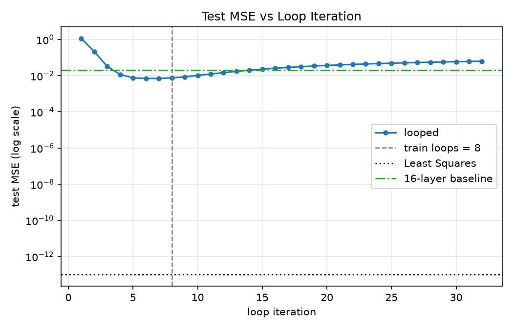

# SimpleLoop

Looped Transformer 的个人复现与扩展实验：合成线性回归中的循环推理。

参考 Yang et al. 2024，在合成线性回归任务上训练共享参数的 2 层 Transformer，观察推理轮数如何影响误差，并与 16 层普通 Transformer、最小二乘比较。主要发现：展开深度同为 16 层时，8 轮循环模型的测试 MSE 更低；推理增加到 32 轮后，误差回升。

## 实验设置

每个任务随机采样一个 16 维线性回归权重，给模型 32 个输入与标签对，再预测最后一个 query。训练、验证、测试分别有 10 万、5 千、5 千个独立生成的任务。循环模型训练 8 轮，每轮调用同一组 2 层 Transformer；普通模型一次通过 16 层。两者的 8 轮推理展开深度相同，但这里没有测量 FLOPs、延迟或显存。

## 环境

```bash
conda create -n simpleloop python=3.11 -y
conda activate simpleloop
pip install -r requirements.txt
```

## 跑起来

先生成数据（10 万 / 5 千 / 5 千）：

```bash
python -m src.generate_data --config src/configs/base.yaml
```

训练。`base.yaml` 中 `loop_layers: 2` 是每轮的层数，`baseline_layers: 16` 是普通模型的层数（2×8=16，展开深度对齐）：

```bash
python -m src.train          --config src/configs/base.yaml --run-name main
python -m src.train_baseline --config src/configs/base.yaml --run-name baseline
```

消融 5 组，run 名就用配置文件名去掉后缀：

```bash
python -m src.train --config src/configs/ablation_no_injection.yaml --run-name ablation_no_injection
python -m src.train --config src/configs/ablation_loop_4.yaml       --run-name ablation_loop_4
python -m src.train --config src/configs/ablation_loop_12.yaml      --run-name ablation_loop_12
python -m src.train --config src/configs/ablation_window_1.yaml     --run-name ablation_window_1
python -m src.train --config src/configs/ablation_window_8.yaml     --run-name ablation_window_8
```

嫌麻烦可以一把梭（7 个 run 串行，约 6.5 小时，中途断了重跑会跳过已完成的）：

```bash
nohup ./run_all.sh > outputs/run_all.log 2>&1 &
```

评测和出图：

```bash
python -m src.evaluate     --config src/configs/base.yaml --checkpoint outputs/main/checkpoints/best.pt
python -m src.evaluate     --config src/configs/base.yaml --checkpoint outputs/main/checkpoints/best.pt --num-loops 8
python -m src.evaluate_ood --config src/configs/base.yaml --checkpoint outputs/main/checkpoints/best.pt --num-loops 8
python -m src.evaluate_ood --config src/configs/base.yaml --checkpoint outputs/main/checkpoints/best.pt
python -m src.evaluate_ablation
python -m src.plot_results --run outputs/main
```

## 结果

跑完的结果和图表放在 `results/`，训练产物在 `outputs/`（15G，没进仓库）。

**先看循环次数曲线：** `results/figures/mse_vs_loop.png`。图中横线是 16 层普通模型的测试 MSE，竖线是训练时的 8 轮。



不同训练 loop 数下，测试误差随推理 loop 次数的变化：

| 训练时用几轮 | 误差最低点 | 最低 MSE | 第 32 轮 MSE |
|---|---|---|---|
| 4 | 第 4 轮 | 0.00802 | 0.10180 |
| 8 | 第 7 轮 | 0.00704 | 0.06301 |
| 12 | 第 10 轮 | 0.00602 | 0.02927 |

在这三次训练中，误差最低点落在训练轮数附近；继续增加推理轮数后，误差逐渐回升。表中的“最低点”用于描述曲线，不作为选取主评测轮数的依据。

**跟 baseline 比：**

| 模型 | 推理设置 | 展开层数 | 参数量 | test MSE | R² |
|---|---|---:|---:|---:|---:|
| Looped，训练 8 轮 | 推理 8 轮 | 2×8=16 | 2,103,553 | 0.007573 | 0.992496 |
| 普通 Transformer | 16 层前向一次 | 16 | 16,790,785 | 0.020198 | 0.979988 |
| 同一个 Looped 模型 | 推理 32 轮 | 2×32=64 | 2,103,553 | 0.063007 | 0.937573 |
| 最小二乘 | — | — | — | 1.01e-13 | 1.000000 |

8 轮时，Looped 用约 1/8 的参数量取得了更低的测试误差；32 轮属于超出训练轮数的推理外推，误差已经高于普通模型。完整指标见 [`8 轮评测`](results/main/evaluation_8.json)、[`32 轮评测`](results/main/evaluation.json) 和 [`普通模型评测`](results/baseline/evaluation.json)。

**其它几组：**

- loss window：T=1、4、8 在第 8 轮的 MSE 分别为 0.00716、0.00757、0.00751；T=8 在第 32 轮退化较少（MSE 0.03423）。不同观察点下，“最好”的选择不同。
- input injection：开启后，第 3 轮 MSE 为 0.033，关闭时为 0.083；第 32 轮则分别为 0.063 和 0.058。
- OOD：8 轮推理时，正常输入尺度的 MSE 为 0.00704，输入尺度扩大到 3 倍后为 5.14531；32 轮对应的值是 0.06194 和 4.71575。标签噪声也使误差上升。见 [`8 轮 OOD 结果`](results/main/ood_8.json) 和 [`32 轮 OOD 结果`](results/main/ood.json)；仓库中原有的 OOD 图展示 32 轮结果。
- context length：8 轮推理时，k=1、2、4 的 MSE 分别为 0.951、0.898、0.774，均低于直接预测 0 的 MSE 约 1.010，但略高于相同 k 的最小二乘结果。仓库中原有的 context length 图展示 32 轮结果。

目前每组配置只训练了一次，以上差异来自固定种子的一组实验。检查点按验证集上全部 prompt 前缀、最后几个训练轮次的平均损失选择；测试指标只看最后一个 query。这里复现的是合成线性回归上的部分现象，不代表论文所有任务的结果。

## 踩过的坑

**1. 原先只监督最后一个 query**

第一版只监督最后一个 query，结果 train loss 掉到 0.002、val loss 反而涨到 1.8，测试 R² = −0.002，泛化表现很差。

后来翻论文 Eq.1 才发现，它对**所有 prompt 前缀**求平均：

$$\frac{1}{k+1}\sum_{i=0}^{k}\ell\left(Y_t(P^i),\ f(x_{i+1})\right)$$

也就是一个 task 有 k+1=33 个预测，不是 1 个。改完后，这次实验的测试 R² 在第 8 轮为 0.992，第 32 轮为 0.938。

实现上不用改模型结构——prompt 是 `Ex(x1) Ey(y1) ... Ex(xk) Ey(yk) Ex(xq)` 交替排的，所有偶数位置正好就是这 33 个前缀的输出位置，`H[:, ::2]` 取出来跟 `y` 一一对应。

**2. YAML 把 2e-4 解析成字符串**

`lr: 2e-4` 不是 float 是 `str`，训练到 `AdamW` 那里才炸。必须写成 `0.0002` 或 `2.0e-4`。类似地 `key:value` 不加空格也不是键值对。

**3. `.squeeze(-1)` 和广播**

验证脚本里 `(xq.unsqueeze(1) @ w_hat).squeeze(-1)` 出来是 `[N,1]` 不是 `[N]`，减 `[N]` 的 target 会广播成 `[N,N]`，MSE 算出来是个看着挺正常的数（≈2，正好是 y 的方差的两倍）。现在训练循环里加了形状断言。

## 文件

```
src/configs/          配置（base + 5 组消融）
src/                  模型、数据、训练、评测
src/train*.py         训练入口
src/evaluate*.py      评测入口
src/plot_results.py   出图
run_all.sh            串行跑完全部实验
results/              跑完的结果与图表
data/                 数据集（未进仓库）
outputs/              训练产物（未进仓库）
```

## 参考

Yang et al. 2024. Looped Transformers are Better at Learning Learning Algorithms. ICLR 2024.
